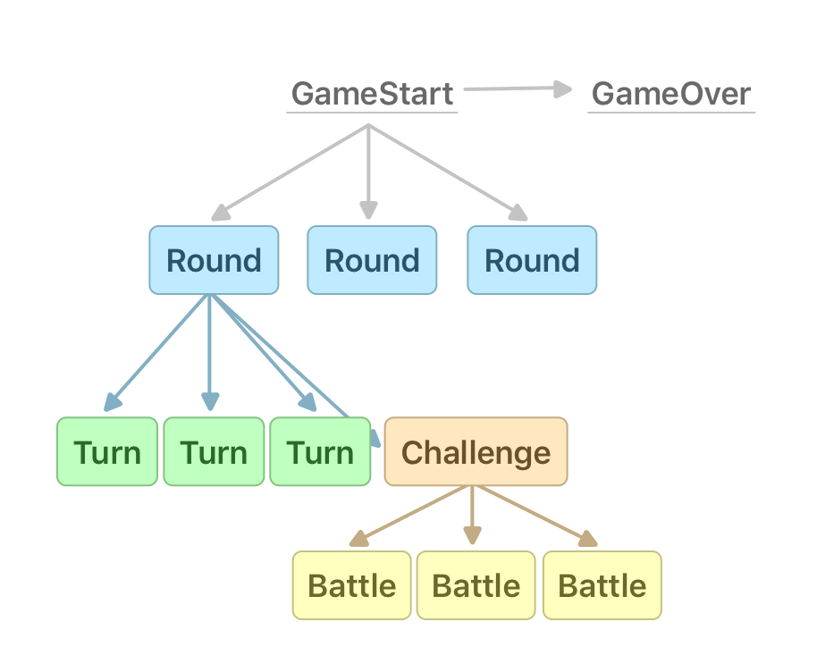
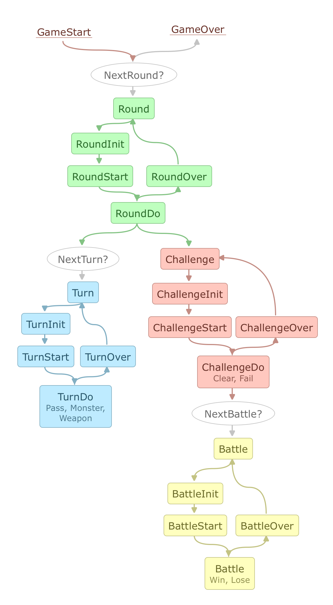

## 맨덤의 던전
- `Game Logic`은 `Python`으로 작성
- `GUI`는 `C++ MFC`를 사용해서 작성
- `DynamicStatusTree`를 사용한 Logic 제어
- [맨덤의 던전(2013)](https://namu.wiki/w/맨덤의%20던전)

### StatusTree
- `Tree` 구조의 데이터를 깊이 우선 순회하는 것과 같이 `Status Node`로 구성된 `Status Tree`를 깊이 우선 순회함으로 인해 게임의 로직을 제어한다
- `DynamicStatusTree`는 `StatusTree`를 순회하는 도중에 게임의 상태값에 따라서 다음 방문 `Status Node`가 동적으로 정해지는 구조이다

### Simple Version

### Full Version

